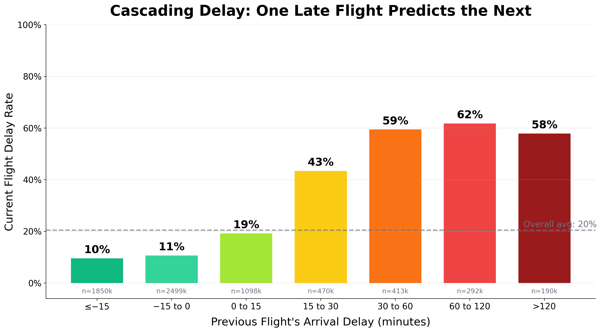
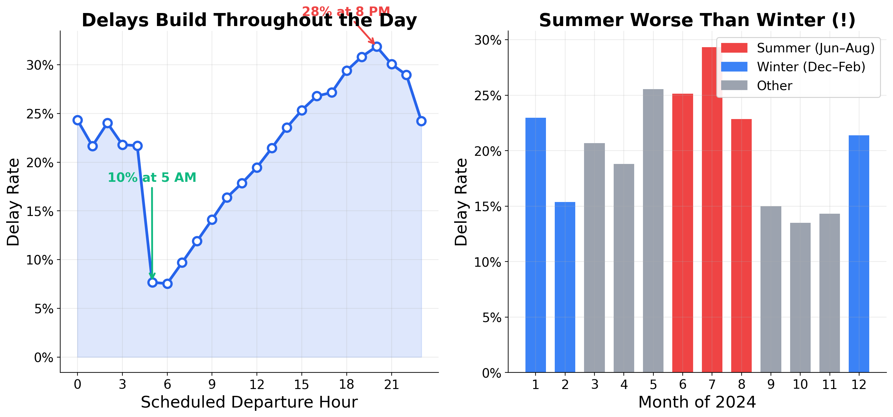
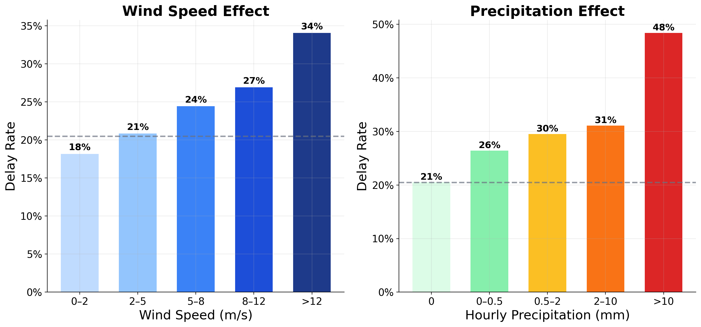
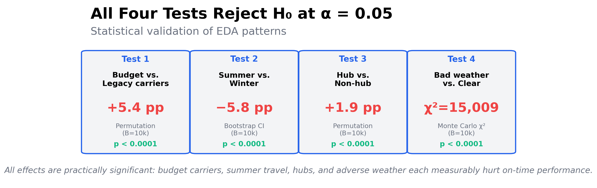
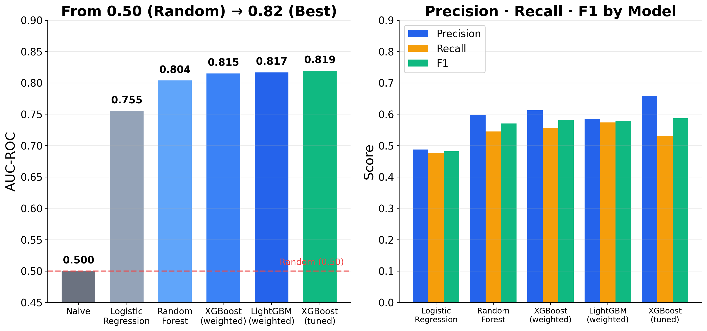
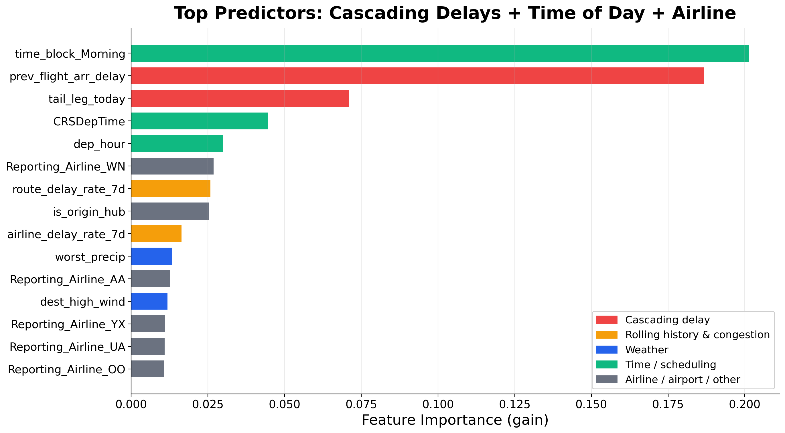

# Presentation Script — Flight Delay Prediction
# 演讲讲稿 — 航班延误预测

**Total target time**: 9–10 min
**Slides**: 14
**Charts location**: `slides/figs/`

---

## 📂 Chart File Reference

| Slide | Chart File | Notes |
|---|---|---|
| 5 | `slides/figs/slide_cascading_delay.png` | The killer chart — cascading delay |
| 6 | `slides/figs/slide_temporal_patterns.png` | Hour + Month combined |
| 7 | `slides/figs/slide_weather_effect.png` | Wind + Precipitation |
| 8 | `slides/figs/slide_hypothesis_tests.png` | 4 test summary card |
| 10 | `slides/figs/slide_model_performance.png` | AUC + P/R/F1 bars |
| 11 | `slides/figs/slide_feature_importance.png` | Top 15 features |

---

## ⏱ Timing Plan

| # | Slide | Time | Cumulative |
|---|---|---|---|
| 1 | Title | 0:10 | 0:10 |
| 2 | The Problem | 0:45 | 0:55 |
| 3 | Value Proposition | 0:40 | 1:35 |
| 4 | Dataset | 0:45 | 2:20 |
| 5 | EDA #1: Cascading Delay 🎯 | 1:00 | 3:20 |
| 6 | EDA #2: Temporal Patterns | 0:40 | 4:00 |
| 7 | EDA #3: Weather Effect | 0:40 | 4:40 |
| 8 | Hypothesis Tests | 0:50 | 5:30 |
| 9 | Modeling Approach | 0:45 | 6:15 |
| 10 | Model Performance | 1:00 | 7:15 |
| 11 | Feature Importance | 0:40 | 7:55 |
| 12 | Implications: Insurance ROI 💰 | 1:00 | 8:55 |
| 13 | Challenges & Future Work | 0:40 | 9:35 |
| 14 | Q&A | 0:15 | 9:50 |

---

# Slide 1 — Title

## On-Screen Content

**Title**: Predicting U.S. Flight Delays
**Subtitle**: When will your flight be late, and why does it matter?

CIS 5450 · Big Data Analytics · Spring 2026

**Team**: Xiaoyang Wan · Dong Dong · Yihong Yu · Yanchen Zhou

## 🎤 Speaker Notes (10 sec)

> "Hi everyone. We're [team], and our project is U.S. flight delay prediction. We took a year of flight data and weather data, and built a model to predict whether your flight is going to be late. Let's get into it."

---

# Slide 2 — The Problem

## On-Screen Content

**Title**: Flight Delays Cost the U.S. **$30 Billion a Year**

- Nearly **20%** of U.S. domestic flights are delayed ≥15 minutes
- One delay cascades — missed connections, displaced crews, idle gates
- The pain is felt by passengers, airlines, airports, and insurers
- We use **6.8 million flight records** from 2024 to predict who's at risk

**Visual hint**: Big "$30B" number on the right; small plane icon on the left

## 🎤 Speaker Notes (45 sec)

> "Last year, almost one in five domestic flights in the U.S. left late by 15 minutes or more. The FAA estimates the total economic cost of these delays at **30 billion dollars a year**.
>
> But the bigger problem isn't just the dollar number — it's that delays *cascade*. One late flight makes a tight connection impossible. A displaced aircraft means the next flight starts late too. A delayed crew has to be replaced under FAA duty rules.
>
> So our question was simple: *given everything we know before the plane is supposed to leave the gate, how well can we predict whether it'll actually be on time?* We built our system on 6.8 million flight records from all of 2024."

---

# Slide 3 — Value Proposition

## On-Screen Content

**Title**: Who Benefits from Better Predictions?

| Stakeholder | What they gain |
|---|---|
| ✈️ **Passengers** | Smarter booking, insurance, planning |
| 🏢 **Airlines** | Proactive rebooking, crew scheduling |
| 🛫 **Airports** | Gate allocation in high-risk windows |
| 💼 **Insurers** | Risk-priced delay insurance products |

**Bottom emphasis line**: We'll show a concrete **+340% ROI** example for the insurance use case at the end.

## 🎤 Speaker Notes (40 sec)

> "Why does anyone care if we can predict delays? Four kinds of stakeholders.
>
> *Passengers* can pick the more reliable flight or buy delay insurance. *Airlines* can pre-position crews and reroute aircraft before disruptions snowball. *Airports* can pre-staff gates during forecasted bad windows. And *insurers* — this is the most concrete one — can price flight delay insurance more accurately or even arbitrage it.
>
> We'll come back to that insurance angle at the end with actual ROI numbers — it's a clean way to put a dollar value on the model."

---

# Slide 4 — Dataset

## On-Screen Content

**Title**: 6.8M Flight Records + Hourly Weather

| Source | What | Coverage |
|---|---|---|
| **BTS On-Time Performance** | Every U.S. domestic flight | Full year 2024, 7.08M → 6.82M after cleaning |
| **NOAA ISD-Lite** | Hourly surface weather | 50 stations co-located with top airports, 8,760 hours each |

**Integration challenge**: weather is hourly + irregular; flights are minute-precise.
**Solution**: `merge_asof(direction="nearest", tolerance=1 hour)` — match each flight to its closest weather observation.

**Visual hint**: BTS logo + NOAA logo arrows merging into a unified table

## 🎤 Speaker Notes (45 sec)

> "We worked with two public datasets. First is the Bureau of Transportation Statistics' On-Time Performance database — every U.S. domestic flight from 2024, including scheduled and actual times, airline, route, aircraft tail number. Seven million rows, six-point-eight after cleaning.
>
> Second is NOAA's hourly weather observations — temperature, wind, precipitation — at the 50 busiest U.S. airports.
>
> The technically tricky part is *joining them*. Flights are minute-precise; weather is hourly and sometimes irregular. We used pandas' `merge_asof` to match each flight to its nearest-in-time weather reading at its origin airport, with a 1-hour tolerance. About 95 percent of flights at top-50 airports got a valid weather match."

---

# Slide 5 — EDA #1: Cascading Delays 🎯

## On-Screen Content

**Title**: One Late Flight Predicts the Next

**Big takeaway box** (right side or bottom):
> When the **previous flight is 60–120 min late**, the **next flight has a 62% delay rate** — vs. **10% baseline** when on-time.

## 🎤 Speaker Notes (60 sec — most important slide)

> "This is the single most important chart of our project. On the x-axis: how late was the *previous* leg of the same aircraft? On the y-axis: how often is the *next* flight delayed.
>
> When the prior leg was on-time or early — the green bars on the left — only about 10% of next flights are delayed. That's *below* the 20% overall average.
>
> But look at what happens when the prior leg was late. A 30-to-60 minute delay on the previous leg pushes the next-flight delay rate up to 59%. A 60-to-120 minute delay pushes it to 62%. So the same plane being late once basically *guarantees* trouble for its next departure.
>
> The takeaway: it's not the airline, it's not the weather, it's the *aircraft rotation*. Tracking same-tail-number history is the strongest single predictor we found — by a wide margin."

---

# Slide 6 — EDA #2: Temporal Patterns

## On-Screen Content

**Title**: Delays Build Throughout the Day & Year

**Bullets**:
- Delay rate climbs from **~10% at 5 AM** to **~28% at 8 PM** — daily cascading effect
- **Summer worse than winter** — counterintuitive!
- Likely cause: thunderstorm season + peak vacation traffic

## 🎤 Speaker Notes (40 sec)

> "Two clear temporal patterns. On the left: as the day goes on, delay rates climb steadily — from about 10% for the earliest morning flights to nearly 30% for evening departures. That's the same cascading effect we just saw, but aggregated across the system: the longer the operational day runs, the more accumulated disruption.
>
> On the right: delay rate by month. Most people guess winter is the worst because of snow — but actually summer is significantly worse. June, July, August are the red bars. The driver is convective weather: thunderstorms are short, intense, and harder to plan around than scheduled snow events. And summer is also peak travel volume."

---

# Slide 7 — EDA #3: Weather Effect

## On-Screen Content

**Title**: Bad Weather Roughly Doubles the Delay Rate

**Bullets**:
- Heavy precipitation (>10 mm/h): **48% delay rate** vs 21% baseline
- Strong wind (>12 m/s): **34% delay rate**
- Both effects monotonic — more weather = more delay

## 🎤 Speaker Notes (40 sec)

> "Weather matters too. On the left, wind speed: as wind picks up, delay rate climbs from 18% in calm conditions to 34% with strong winds. On the right, precipitation: light rain barely moves the needle, but heavy rain — over 10 millimeters per hour — pushes delay rate to 48%, more than double the baseline.
>
> Both effects are monotonic and substantial. But — and this is the punchline — weather still ranks behind cascading delays in our final model. The reason is that bad weather days affect *every* flight, so the *relative* signal is smaller than knowing one specific aircraft is having a bad day."

---

# Slide 8 — Hypothesis Tests

## On-Screen Content

**Title**: Statistically Validating EDA Patterns

**Footer**: All four tests use simulation methods covered in class — permutation, bootstrap, Monte Carlo. All four reject the null hypothesis at α = 0.05.

## 🎤 Speaker Notes (50 sec)

> "We backed up the EDA findings with four formal hypothesis tests, all using simulation methods.
>
> Test 1: budget carriers like Spirit and Frontier delay 5.4 percentage points more than legacy carriers like Delta and United — permutation test, ten thousand iterations, p less than one in ten thousand.
>
> Test 2: summer is 5.8 points *worse* than winter, validated with a bootstrap confidence interval that doesn't include zero.
>
> Test 3: hub airports delay 1.9 points more than non-hubs — small but real.
>
> Test 4: a chi-squared test on adverse weather versus delay using Monte Carlo for the null. The chi-squared statistic is over 15,000.
>
> All four reject the null. The patterns we saw in EDA aren't noise."

---

# Slide 9 — Modeling Approach

## On-Screen Content

**Title**: Predicting Delay ≥15 min — Before Takeoff

**Bullets**:
- **Target**: `DepDel15` (binary — delayed at least 15 min)
- **Train**: Jan–Oct 2024 (5.6M flights) · **Test**: Nov–Dec 2024 (1.1M flights)
- **23 engineered features** across 8 categories: time, weather, congestion, cascading
- **No leakage**: all rolling features use `shift(1)` — only past data feeds today's prediction
- Tested multiple models: Logistic Regression → Random Forest → XGBoost / LightGBM

**Visual hint**: Simple timeline graphic — blue bar Jan–Oct (train), orange bar Nov–Dec (test)

## 🎤 Speaker Notes (45 sec)

> "Now to the modeling. We treat this as binary classification: will the flight be delayed by at least 15 minutes?
>
> The most important design choice is the train-test split. We *don't* use random splitting — we split *temporally*. Train on January through October, test on November and December. Random splitting would let the model peek at future information through our rolling-history features, which would inflate scores artificially.
>
> We engineered 23 features across 8 categories — time-of-day, holidays, hub indicators, rolling delay rates, the cascading prior-flight delay, congestion, and weather. Critically, all rolling features use `shift(1)` *before* the rolling window, so today's target never leaks into today's feature.
>
> We benchmarked a series of models — Logistic Regression as baseline, then Random Forest, then XGBoost and LightGBM."

---

# Slide 10 — Model Performance

## On-Screen Content

**Title**: From AUC 0.50 → 0.82

**Highlight box** (small):
> Tuned XGBoost: **AUC 0.819, F1 0.587** at threshold 0.566.

## 🎤 Speaker Notes (60 sec)

> "Here are the headline results. Left chart: AUC by model.
>
> The naive baseline — always predict on-time — gets AUC of exactly 0.5, the same as flipping a coin. That model is useless even though it's right 80% of the time on overall accuracy, because it never *catches* a delay.
>
> Logistic regression jumps us to 0.76. Random forest to 0.80. XGBoost and LightGBM both around 0.82. After hyperparameter tuning with randomized search across 30 configurations and 3-fold cross-validation, our tuned XGBoost reaches AUC 0.819. After threshold tuning on the precision-recall curve, F1 climbs to 0.587.
>
> The right chart breaks down precision, recall, and F1. Notice that simpler models have lower precision *and* lower recall — they're worse on both axes. The tuned XGBoost trades a bit of recall for substantially better precision, which is what we want for an actionable predictor."

---

# Slide 11 — Feature Importance

## On-Screen Content

**Title**: What the Model Actually Uses

**Bullets**:
- `prev_flight_arr_delay` (cascading) consistently in top 2
- Time-of-day & airline identity also prominent
- Weather features rank mid-tier — confirms the EDA story

## 🎤 Speaker Notes (40 sec)

> "When we look at what the tuned model actually weighs, the EDA story is confirmed. The cascading-delay feature — that previous-leg arrival delay we showed earlier — is at the top, alongside time-of-day features.
>
> Weather features — wind, precipitation, temperature — show up in the middle of the chart. Important but secondary. And airline identity appears as a series of one-hot dummies, with budget carriers like Southwest, American, and United all appearing in the top 15.
>
> So the model picked the same patterns we found in EDA, which is comforting — and it gives us a clean story to tell stakeholders about *why* a particular flight was flagged."

---

# Slide 12 — Implications: Insurance ROI 💰

## On-Screen Content

**Title**: Real-World Value: Selective Flight Delay Insurance

**Strategy comparison table**:

| Strategy | Buy insurance for... | Realized delay rate | ROI |
|---|---|---|---|
| Naive | Every flight | 17.9% (base rate) | **+19%** |
| **Our model** | Only flights flagged "high risk" | **65.9%** (model's precision) | **+340%** |

**Big number** (right side):
> 18× ROI multiplier from one prediction model

**Bullets**:
- Insurers price by base rate (~18%) → premium ≈ 18% × payout
- Our model selects flights with 66% actual delay rate
- Information asymmetry = financial edge

## 🎤 Speaker Notes (60 sec)

> "Let me put a concrete dollar value on this with the insurance use case.
>
> Flight delay insurance is priced by the actuarial average — about 18 percent of all flights are delayed, so a fair premium is roughly 18 percent of the payout. If you buy insurance for *every* flight, you get a small positive return — about 19 percent ROI in our calculation, since you're slightly under-priced.
>
> But our model's *precision* is 66 percent — when we say 'this flight is at risk,' we're right two-thirds of the time, much higher than the 18 percent base rate that insurers price against.
>
> So if you buy insurance *only* on flights our model flags, your realized payout rate jumps to 66 percent. The ROI in that scenario is 340 percent — about 18 times better than the no-information strategy.
>
> Now, real insurers aren't going to let this arbitrage stand forever, but the math illustrates the broader point: information has value, and a model with AUC 0.82 captures meaningful information."

---

# Slide 13 — Challenges & Future Work

## On-Screen Content

**Title**: What We Learned + What's Next

**Two-column layout:**

**Challenges (left)**:
- 6.8M rows broke standard sklearn solvers — moved to SGD + GBDT
- Class imbalance (80:20): SMOTE vs. weights — weights won
- Weather temporal alignment: solved with `merge_asof`
- Validated 500k subsample matches 5.6M full data (ΔAUC < 0.002)

**Future Work (right)**:
- **Cross-year validation**: train 2024, test 2025
- **Upstream weather forecasts** (HRRR/GFS): predict before the storm hits
- **Per-airport models**: hubs differ from regional airports
- **Real-time streaming**: update predictions as departure nears

## 🎤 Speaker Notes (40 sec)

> "A few honest reflections. The dataset size broke standard scikit-learn — Logistic Regression timed out at 30 minutes — so we switched to stochastic gradient descent and gradient-boosted trees. We tested SMOTE versus class weights for imbalance; class weights won on recall. And we validated that our 500k subsample for tuning matches full-data performance to within 0.002 AUC.
>
> For future work: the biggest gap is cross-year validation — train on all of 2024 and test on 2025 — that's the gold standard we didn't have time for. Beyond that, integrating *forecast* weather instead of observed, building per-airport models for the major hubs, and a real-time pipeline that updates predictions hour by hour as departure approaches.
>
> That's our project. Thank you."

---

# Slide 14 — Q&A

## On-Screen Content

**Title**: Thank You — Questions?

- Code & notebooks: `github.com/trumpool/CIS-5450`
- Team: Xiaoyang Wan · Dong Dong · Yihong Yu · Yanchen Zhou

## 🎤 Speaker Notes (10 sec)

> "Happy to take any questions."

---

## 🎯 Anticipated Q&A — Have These Ready

**Q: Why temporal split instead of random?**
> Random splitting leaks future information through rolling features. A November flight's `airline_delay_rate_7d` would partially overlap with December training data. Temporal split simulates real forecasting.

**Q: Isn't `prev_flight_arr_delay` data leakage?**
> No — it's the *previous* leg of the same aircraft. By the time the current flight is at the gate, the previous leg has already landed. It's known information.

**Q: Why did SMOTE underperform?**
> SMOTE creates synthetic minority samples in feature space, which on tabular data with many categorical features can produce unrealistic interpolations. Class weights re-weight existing data, which is a softer intervention. On our data, recall dropped sharply with SMOTE — from 0.55 to 0.42 — while gaining precision. Net F1 was lower.

**Q: Is AUC 0.82 enough for production?**
> Depends on the use case. For a passenger app saying "your flight is at elevated risk," yes — better than nothing. For airline crew scheduling that costs millions to override, you'd want calibrated probabilities and probably ensemble with operational data we don't have access to.

**Q: Why is regression so much weaker than classification?**
> Because exact delay duration is dominated by extreme outliers — a 4-hour delay is qualitatively different from a 30-minute one but RMSE treats them on the same scale. Binary "is it delayed" is more tractable and more actionable.

**Q: How would you extend this to other modes of transport?**
> The cascading-delay insight likely generalizes — train rotation in rail networks, vessel rotation in shipping. The weather-integration pattern is reusable. The biggest barrier would be data availability; not every domain has BTS-style public data.

---

## 📋 Recording Checklist

- [ ] All speakers' faces visible throughout (rubric requirement)
- [ ] Use real voices, no TTS (rubric requirement)
- [ ] No code on any slide (rubric requirement)
- [ ] 8–10 minutes total runtime (under 8 or over 10 = -5 points)
- [ ] Export final slide deck as PDF for submission
- [ ] Test all charts render at presentation resolution (already 200 DPI, 16:9)
- [ ] Practice cadence — aim for 9:30 to leave buffer

---

## 🌟 Pacing Tips

- **Slide 5 (Cascading)** and **Slide 12 (Insurance ROI)** are the wow moments. Slow down on these.
- **Slides 8 (hypothesis tests)** is dense but quick — don't dwell.
- **Slides 13 (challenges/future)** is your last shot to look thoughtful — don't rush off-screen.
- If you're running long, the easiest cuts are: shorten slide 9 modeling-approach detail, and shorten the insurance ROI walkthrough on slide 12.
